# 实验分析 2026/1/12
## actor and critic share weight

- 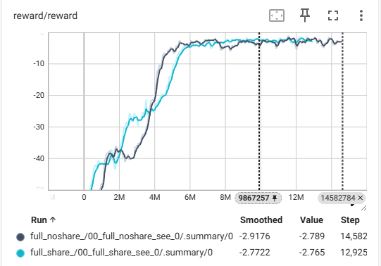    
    比较是否共享权重对实验的影响，在reward图上，两者基本都在5M steps时收敛，不共享权重比共享权重收敛收敛快月1M steps左右。在收敛速度上，两者并无明显区别。

- 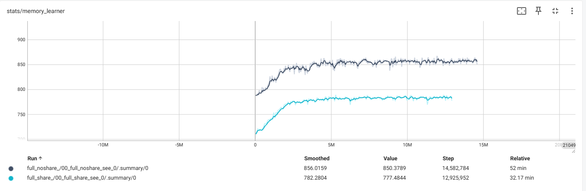
memory_learner指标，非常直观的，不共享权重则意味着更多的计算，由图可以得知，在训练阶段不共享权重比共享权重的内存占用平均多占比70MB。

- 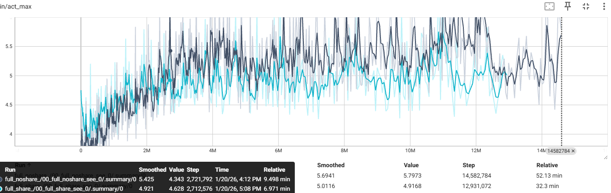  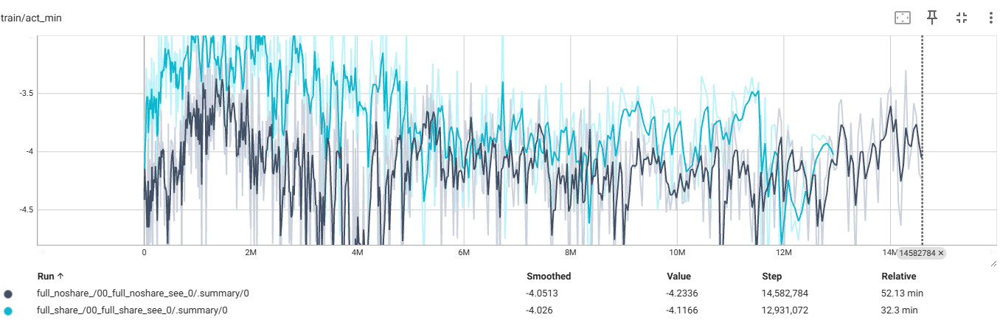    对比两者在动作选择上，可以看出，共享权重网络在动作选择上更加保守，标准差更低。

小结结论：不共享权重，收敛步数少，wall time更快，内存占用低，标准差低，更加适合，此次训练了14M，标准差并未收敛，应该适当放宽训练时间。

## encoder
- 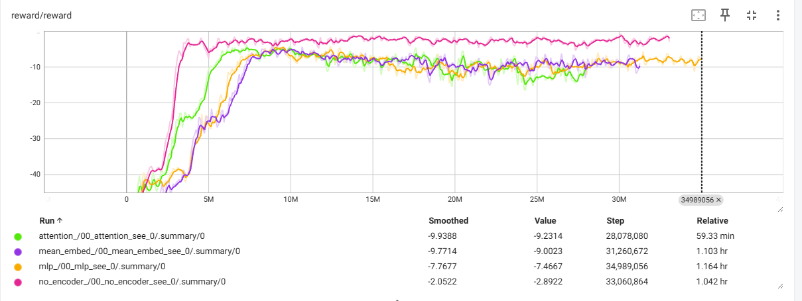  reward中比较了四种编码方式，其中no_encoder收敛最快，attention其后，mlp和mean_embed并无太大区别，no_encoder避免了较多的计算因此收敛最快。同时，no_encoder的reward值还是最高，我们只使用了2个agent，因此，可能并不需要复杂的编码。`换多agent再试试`
- 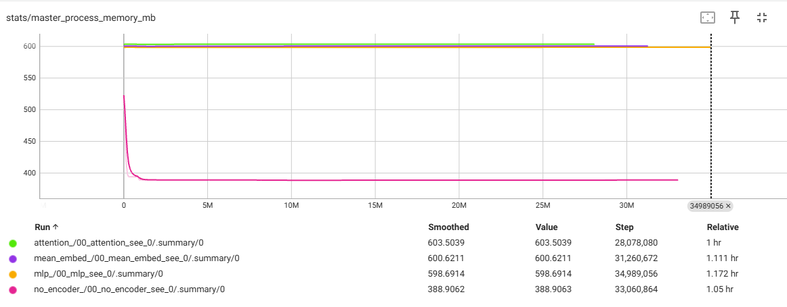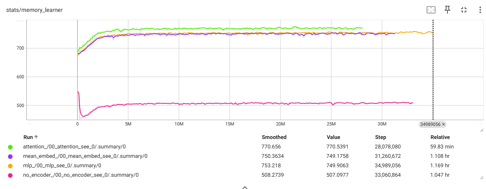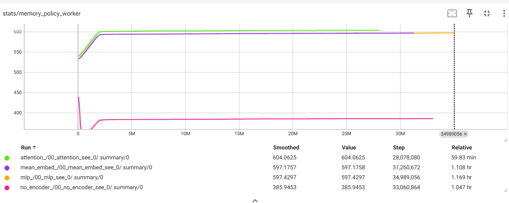
可以看到，no_encoder的情况下，训练占用内存最小，后三者并无明显区别。
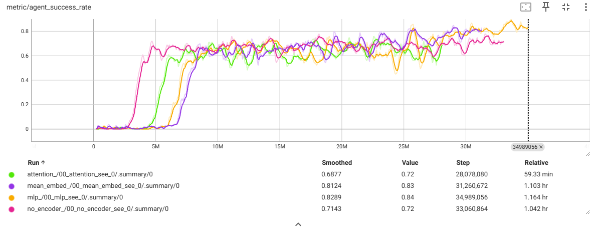
在成功率上，四者并没有明显区别。
- 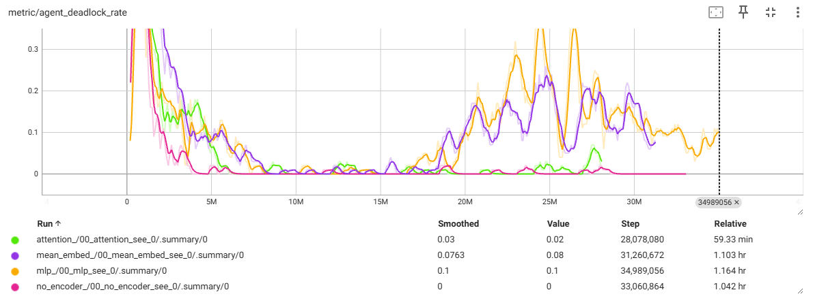
可以看到四种编码方式在10M-15Msteps的适合，几乎不会deadlock，但随着步数增加，no_encoder和attention保持了较低的deadlock，而mlp和mean_embed的dealock增加，但都保持在较低的概率。

## sdf
- 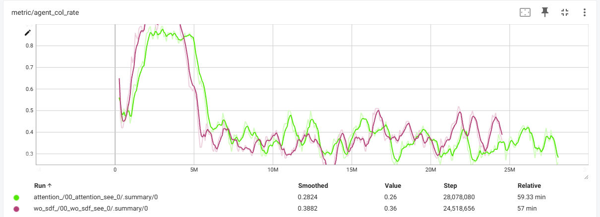
由图可以发现，sdf的可以大致降低0.05的碰撞率，可以说是没用作用。`可能随着训练还会降低`

## summary
- 是否共享权重：并不影响训练结果，但共享权重会占用较大计算资源，因此可以使用不共享权重；
- encoder：在encoder的选择上，可以使用attention；
- sdf：可以使用sdf。