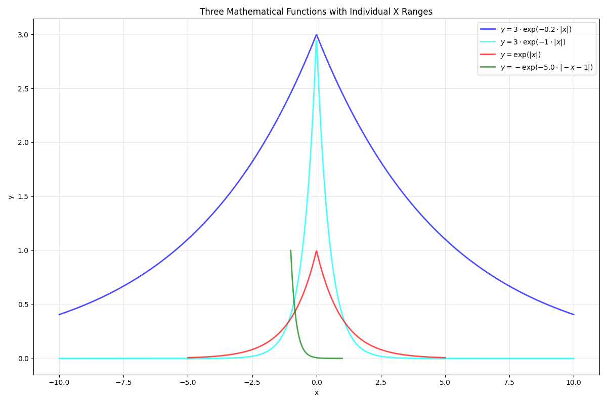

# reward_test/reward component analysis
## 2026/1/26
### pos+effort(13M)
- 现象： 有向目标跟进的迹象，但是自身并不能很好的控制，会不断旋转，因此无法在目标点悬停。
- 改进措施：试着增加训练步数。
- 2026/2/3追加：在添加训练步数后，发现只有pos+effort便可以完成任务，且可以较好的完成任务，避免了复杂的reward rescale。

### pos+spin+effort(13M)
- 现象：可以短暂到达目标点且悬停，但会因为机动需要做出较大的roll或pitch动作导致翻转。
- 改进措施：添加姿态奖励，避免无意义的机动动作。

### pos+spin+orient(7M)
- 现象：存在‘用力过猛’的现象，无法较好的到达目标点。
- 改进措施：添加effort奖励，平滑动作幅度变化。

### pos+spin+orient+effort(7M)
- 现象：可以较好的到达，当距离较远的适合存在‘用力过猛’，会震荡后到达，偶尔会翻转。

### conclusion
- pos和spin是必须的，orient可以改善一些问题但并不能完全避免翻转的发生且会限制无人机的自由动作，effort可以在很大程度上改善路径效率。
- 在pos+spin+orient+effort的奖励情况下，进行rescale。
- 2026/2/3 pos奖励便可以满足，避免了奖励之间互相冲突的情况，effort取了非常小的幅度。

------------------------------------------------------------------------------------------------------------------------
# reward_test/reward-scale-analysis
以下修改了pos和spin的奖励计算方式，改成了e^-kx的方式
### 1pos1spin0orient0.05effort
- 现象：无法完成任务
- 修改建议：pos奖励应占据主导

### 3_0.2pos1_0.2spin_0ori0.05effort
- k_pos=0.2,scale_pos=3 k_spin=0.2,scale_pos=0.2    0.05effort线性
- 现象：完全可以完成任务，但是会出现多次翻转的现象。
- 修改建议：添加姿态奖励

以下加入了orient的奖励计算方式，cost_orient = - np.exp(- 5.0 * np.abs(-cost_orient_raw-1))
### 3_0.2pos  1_1spin   cost_orient = - np.exp(- 5.0 * np.abs(-cost_orient_raw-1))   0.05effort
- 现象：完全可以完成任务，减少了翻转的现象，且距离目标点更近。在5Msteps时，deadlock已经稳定为0且success rate稳定1。但是无人机会[抖动]。
- 分析：姿态奖励有相当重要的占比，抖动来源于姿态控制，姿态的奖励严格要求了无人机必须平稳，因此无人机在无时不刻的进行调整。

## 2026/1/31
### 3_0.2pos  1_1spin   cost_orient = - np.exp(- 5.0 * np.abs(-cost_orient_raw-1))   0.05effort (100M)
- 现象：在10M时，奖励进行第一次增长，在10M ~ 20Msteps，奖励并未明显增长，实则并未收敛，20M~35M steps，奖励第二次进行小幅度增长；40M ~ 60Msteps进行第三次增长；80 ~ 100M进行第四次增长。
- 分析：无人机的路径随着agent的探索不断被优化，且越来越以最优路径，最优控制的方式抵达目标点。
- 修改建议：继续添加训练步数，100M steps的时间大致为4h。

### 3_0.2pos  1_1spin   cost_orient = - np.exp(- 5.0 * np.abs(-cost_orient_raw-1))   0.05effort (300M)
- 现象1：在150M steps时基本收敛32，但之后似乎之后还可以上升，可能上升速度变换，在基本收敛后奖励开始变得波动不稳定，在action_log_std_mean图中我们也可以看出，0~150Msteps时下降速度较快，150Msteps后下降速度变慢，同时action_mean图中，；这说明无人机依然在寻找最优路径。
- 现象2：无人机的飞行已经变得非常顺滑，但是飞行轨迹仍然有较大冗余。

- 分析2：在e图上去看在无人机距今进入6m左右的时候，spin奖励分量和orient逐渐发挥主导作用，因此会进行调整，甚至绕行转圈，致使产生轨迹冗余。
- 修改建议1： 只使用位置奖励，让agent自行探索。
- 修改建议2： balance各个reward，可以分为两种方式3_0.2pos，两个参数都可以调整，我们主要调整后面的参数，使距离在0.5m外一直处于主导。

# single_pos(110M)
- demo现象：无人机停在了离目标位置更近的位置，因为只有距离奖励，无人机会做出比较激进的动作，同时会有无意义的抖动和旋转，但总体来说，可以较好的完成任务。
- 训练奖励：在10M左右奖励达到了20，基本可以完成任务，之后奖励依然非常缓慢的增长，可能在进行路径优化。
- std：100Msteps中，持续下降，可能存在优化空间。
## 结论
- 对于无人机飞行来说，似乎单一的距离奖励便可以完成任务，需要足够的steps。后继可以放在有障碍物的环境中进行。基本确定单一位置奖励。